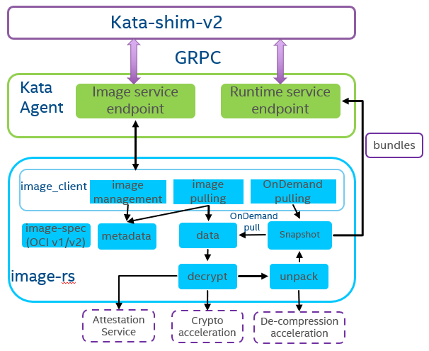

# Design and architecture

## Design
image-rs crate is a tailored version of [containers/image](https://github.com/containers/image)
and provide a small, simple, secure and fast OCI container image
management rust implementation. For the API part, we will provide
[CRI image service](https://github.com/kubernetes/cri-api/blob/master/pkg/apis/runtime/v1alpha2/api.proto#L119)
compatible API. For the feature set part, we will focusing on support
pod/container run stage and will not cover OCI container image develop
and ship stage. For the overhead and performance part, since our target
scenario may be one copy for each pod and used at pod/container cold
start stage, we need implement it with low-cost and high performance.

image-rs will support both encrypted and unencrypted container image format since
[encrypted container image](https://github.com/opencontainers/artifacts/pull/15)
is mandatory in many confidential container scenarios, and consume
[ocicrypt-rs](https://github.com/containers/ocicrypt-rs) rust crate for decryption.

A stretch goal is to improve the container cold startup speed by supporting
OnDemand or lazily image pulling. These features already implemented by
several projects like [nydus](https://github.com/dragonflyoss/image-service),
[stargz](https://github.com/containerd/stargz-snapshotter)
and supported by containerd. But how to combine OnDemand pulling and
OnDemand decryption together, we still have lots of work to do like
define related container image metadata and data format.

### Goals
 * Support OCI image pulling from remote registries
 * Support OCI image loading from local [OCI layout compatiable](https://github.com/opencontainers/image-spec/blob/main/image-layout.md) storage
 * Support OCI image decryption
 * Support OCI image signing verification
 * Support OCI image decryption and unpack acceleration
 * Support OnDemand image pulling
 * Can be seamlessly integration with Kata Agent and Attestation Agent

### Non-Goals
 * Image push, content discovery/management operations for remote registries
 * Image encryption and signing
 * Image export to local storage
 * Image import from other service daemon or other local storage format

### Current solutions
 * [containers-image-proxy-rs](https://github.com/containers/containers-image-proxy-rs)
 * [oci-distribution](https://github.com/krustlet/oci-distribution)
 * [oci-registry-client](https://github.com/ecarrara/oci-registry-client)

containers-image-proxy-rs is a rust bindings for skopeo which did not meet our small
and lightweight requirement. oci-distribution is a crate for [krustlet](https://github.com/krustlet/krustlet)
which is a rust implemented kubelet for running wasm. Since wasm is
platform agnostic and small code size, oci-distribution did not support
manifest lists for different platforms and internal data struct is not friend
to generic container workload. oci-registry-client is a very simple client for
OCI image registries with limited features and latest commit is one and
half years ago. These projects also do not support image unpack and
storage management features.

## Architecture
The following diagram demonstrates the overall architecture and how to
integrate with Kata Agent:

The image_client module will provide the API and mainly cover image management,
image pulling and OnDemand image pulling.

For image pulling part, it will separate the container image as two parts:
metadata and data, for metadata it can be consumed by the image management
module and the data part can be decrypted by ocicrypt-rs if needed. After
image data is unpacked, snapshots module will prepare the rootfs together with
the container configuration and metadata, the bundles can be generated for the
runtime service to consume.

Since data decryption and de-compression can be time consuming, we should also
support different acceleration libraries to accelerate these process like
Intel storage acceleration library:
[isa-l](https://github.com/intel/isa-l)
[isa-l_crypto](https://github.com/intel/isa-l_crypto).

The snapshot module can support different snapshotters which can support
image OnDemand pulling.

The image-spec module will define the [OCI image spec](https://github.com/opencontainers/image-spec)
to avoid the dependency of other heavy crates.
